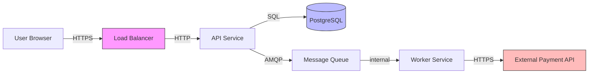

# Security Architecture — Threat Modeling & Design Review

This skill guides Claude through systematic security reviews of software architectures and features, producing actionable findings grounded in threat modeling and security design principles.

## Quick Reference

| Goal | Reference |
|------|-----------|
| Perform STRIDE threat modeling | [THREAT-MODEL.md](THREAT-MODEL.md) |
| Check against OWASP Top 10 | [OWASP.md](OWASP.md) |
| Select and verify security controls | [CONTROLS.md](CONTROLS.md) |

## Security Review Workflow

### Step 1 — Define the Review Scope

Establish boundaries before analyzing:

```
SYSTEM       What components / services are in scope?
DATA         What sensitive data does the system handle? (PII, credentials, payments, health)
ACTORS       Who are the principals? (end users, admins, service accounts, external systems)
TRUST ZONES  What are the trust boundaries? (internet-facing, internal network, privileged zone)
ENTRY POINTS All surfaces where external data enters the system
```

### Step 2 — Draw the Data Flow Diagram (DFD)

Produce a Level-1 DFD using Mermaid:



Mark **trust boundaries** as dashed lines. Every crossing is a security concern.

### Step 3 — STRIDE Threat Modeling

Read [THREAT-MODEL.md](THREAT-MODEL.md) for the full STRIDE methodology.

For each component and trust boundary crossing, evaluate all six threat categories:

| Threat | Question |
|--------|---------|
| **S**poofing | Can an attacker impersonate a user, service, or component? |
| **T**ampering | Can data be modified in transit or at rest without detection? |
| **R**epudiation | Can actors deny actions they performed? |
| **I**nformation Disclosure | Can sensitive data be exposed to unauthorized parties? |
| **D**enial of Service | Can an attacker prevent legitimate use? |
| **E**levation of Privilege | Can an attacker gain more permissions than granted? |

### Step 4 — OWASP Top 10 Scan

Read [OWASP.md](OWASP.md) and evaluate each category against the design.
Flag any category where the design does not have an explicit control.

### Step 5 — Authentication & Authorization Deep-Dive

For every principal:

**Authentication**:
- How is identity established? (password, OAuth 2.0, mTLS, API key, SSO)
- Is MFA enforced for privileged roles?
- How are credentials stored, rotated, and revoked?
- Session lifetime and invalidation strategy?

**Authorization**:
- Model: RBAC, ABAC, or ACL?
- Is authorization enforced at the service layer (not just the UI)?
- Are there any privilege escalation paths?
- Is principle of least privilege applied to service accounts?

### Step 6 — Select Controls

For each identified threat, map to a control from [CONTROLS.md](CONTROLS.md).
Every HIGH/CRITICAL finding must have a control assigned.

### Step 7 — Produce the Security Review Report

```markdown
## Security Architecture Review: <System / Feature>

### Scope
[From Step 1]

### Data Flow Diagram
[Mermaid DFD]

### Threat Model Summary
| ID | Threat Category | Component / Flow | Severity | Control |
|----|----------------|-----------------|----------|---------|
| T1 | Spoofing | User → API | HIGH | JWT with short expiry + refresh token rotation |
| T2 | Information Disclosure | DB backup files | MEDIUM | AES-256 encryption at rest |

### OWASP Coverage
| Category | Status | Notes |
|----------|--------|-------|
| A01 Broken Access Control | ✅ Addressed | RBAC enforced at service layer |
| A02 Cryptographic Failures | ⚠️ Partial | TLS 1.3 in transit; key rotation not yet defined |
| A03 Injection | ✅ Addressed | Parameterised queries; no dynamic SQL |

### Authentication & Authorization Assessment
[Findings from Step 5]

### Findings
For each finding:
- **ID**: F-001
- **Severity**: CRITICAL / HIGH / MEDIUM / LOW / INFO
- **Title**: One-line description
- **Description**: What the vulnerability is and how it manifests
- **Impact**: What an attacker could achieve
- **Recommendation**: Specific remediation steps
- **Control reference**: Link to [CONTROLS.md](CONTROLS.md)

### Accepted Risks
[Findings deliberately accepted with justification and owner]

### Security Requirements
Derived mandatory requirements for implementation:
- [ ] All API endpoints must validate the JWT signature before processing
- [ ] Passwords must be hashed with bcrypt, cost factor ≥ 12
- [ ] ...
```

## Severity Definitions

| Severity | Criteria |
|----------|---------|
| **CRITICAL** | Exploitable remotely, no authentication required, direct data loss or system compromise |
| **HIGH** | Exploitable with low effort, significant data exposure or privilege escalation |
| **MEDIUM** | Requires specific conditions, limited impact or scope |
| **LOW** | Hardening recommendation, defence-in-depth improvement |
| **INFO** | Observation, no immediate risk |

## Secure Design Principles (Always Apply)

1. **Defence in depth** — no single control is relied upon; layer controls
2. **Fail secure** — deny by default; errors should not grant access
3. **Least privilege** — every component has only the permissions it needs right now
4. **Complete mediation** — every access to every resource is checked every time
5. **Separation of privilege** — critical operations require more than one condition
6. **Minimise attack surface** — expose the fewest interfaces with the fewest capabilities
7. **Don't trust external input** — validate and sanitise at every trust boundary
