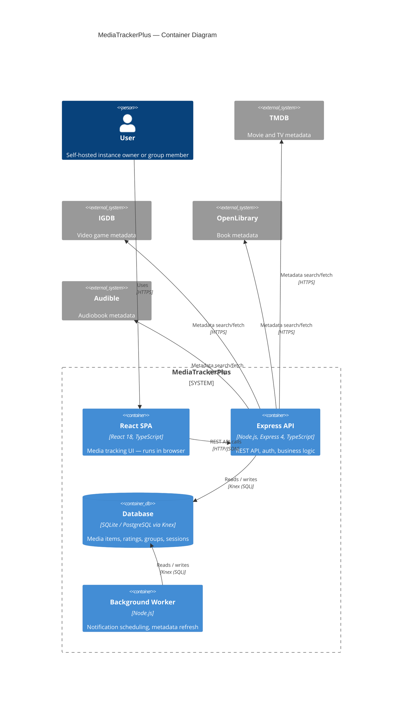
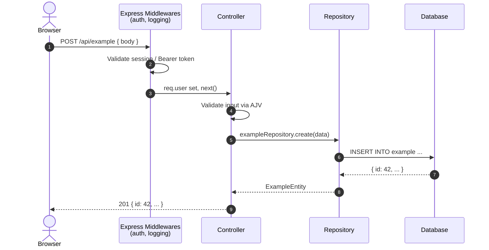
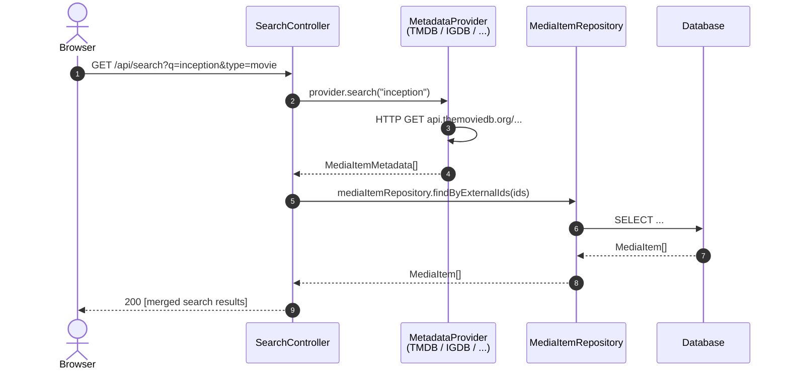
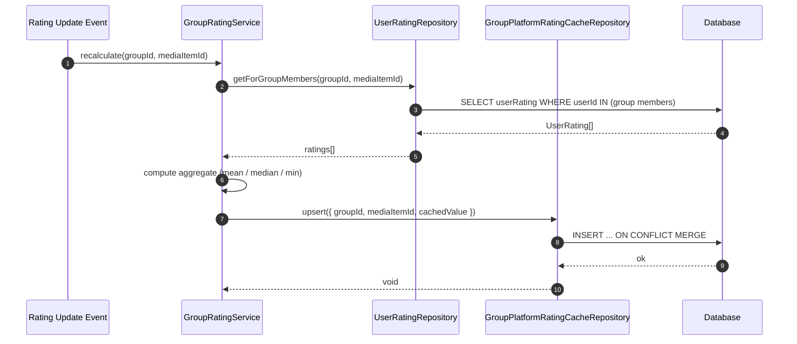
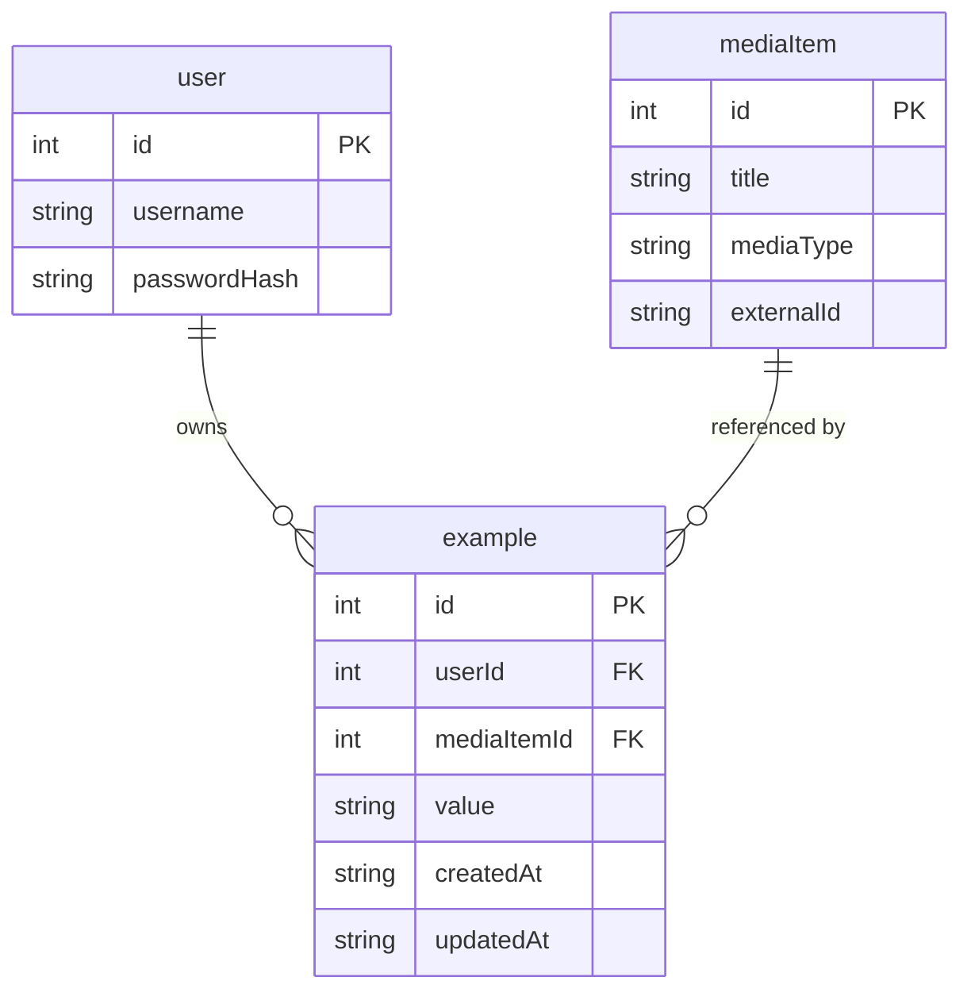
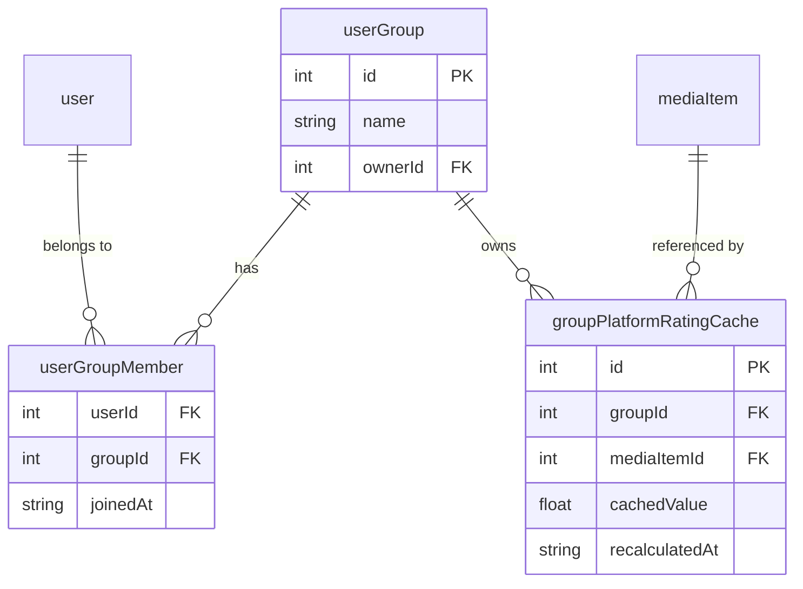
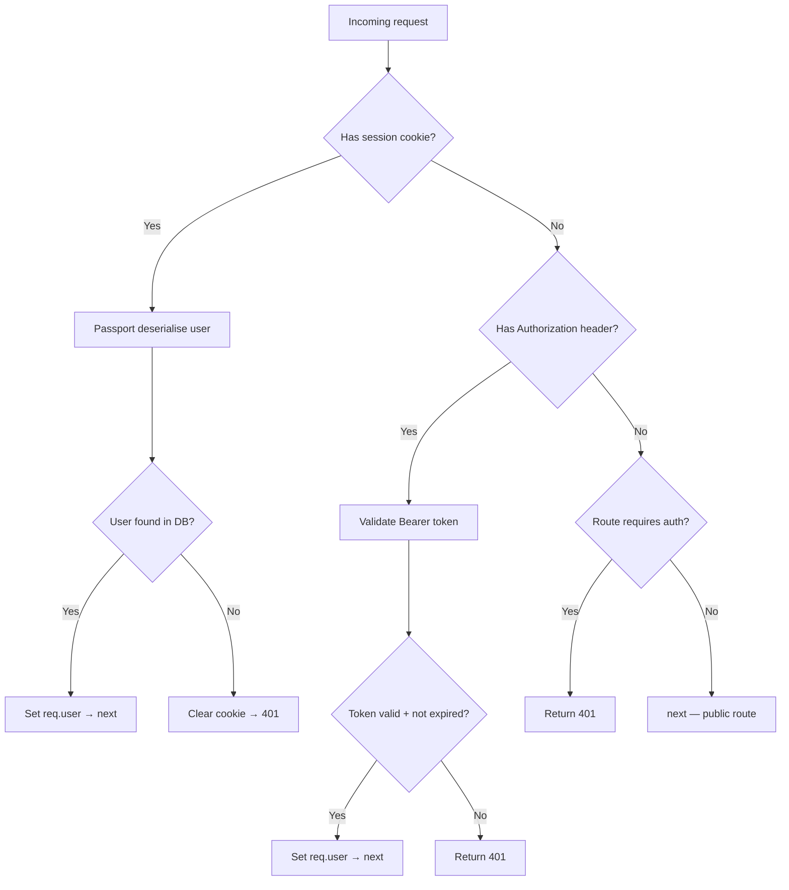
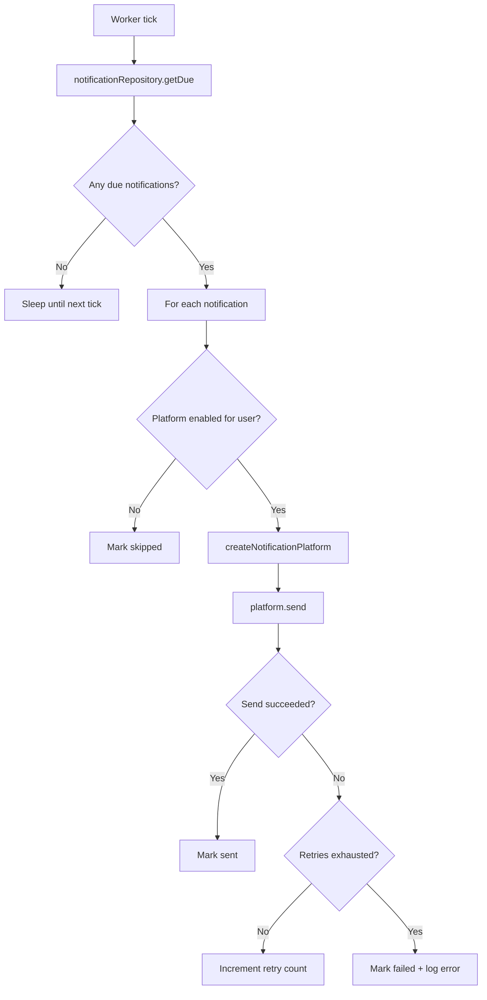
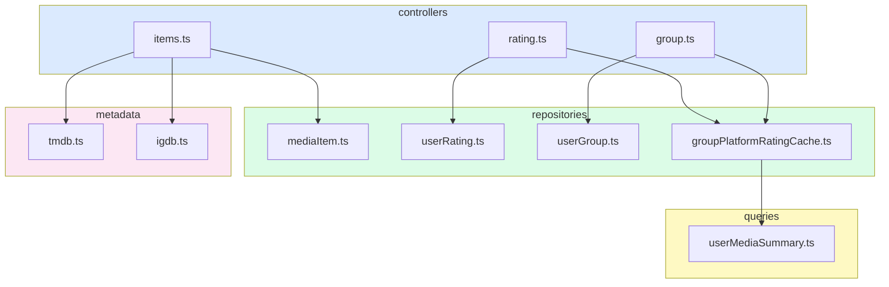

# Diagram Templates

Mermaid templates for common architectural views in MediaTrackerPlus. Paste and adapt.

---

## §1 C4 Container Diagram

Use for: placing a new feature in the overall system, onboarding, high-level design proposals.



---

## §2 Sequence Diagram

Use for: any feature that crosses more than one layer, explaining auth flows, debugging, API design reviews.

### Template — Authenticated API Request



### Template — Metadata Fetch Flow



### Template — Group Rating Recalculation



---

## §3 Entity-Relationship Diagram

Use for: new DB table design, schema reviews, onboarding onto an existing domain.

### Template — New User-Owned Domain



### Template — Group-Shared Domain



---

## §4 Flowchart — Decision / Middleware Logic

Use for: explaining auth flow, middleware chain, complex conditional logic in controllers or services.

### Template — Auth Middleware Flow



### Template — Notification Dispatch Flow



---

## §5 Module Dependency Graph

Use for: coupling analysis, planning a refactor that moves or splits a module.



---

## Diagram Output Format

When producing a diagram in a response, always:

1. State the diagram type and purpose in one sentence before the code block.
2. Use a `mermaid` fenced code block.
3. Add a **Legend** section below if the diagram uses non-obvious shapes or colours.
4. For sequence diagrams, use `autonumber` so steps can be referenced in prose.

```markdown
**Sequence diagram** — illustrates the data flow for creating a new user rating.

```mermaid
sequenceDiagram
  ...
```

**Legend**: Shaded boxes = external services (outside the Express process boundary).
```
