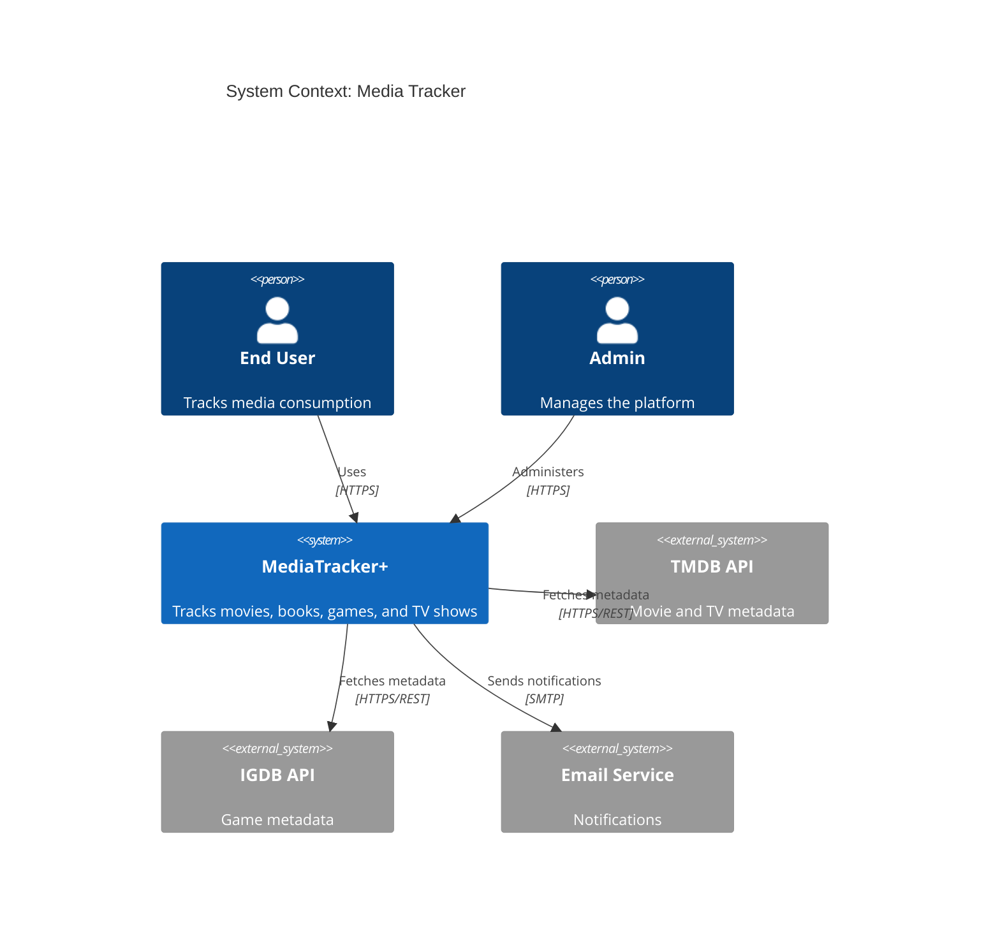
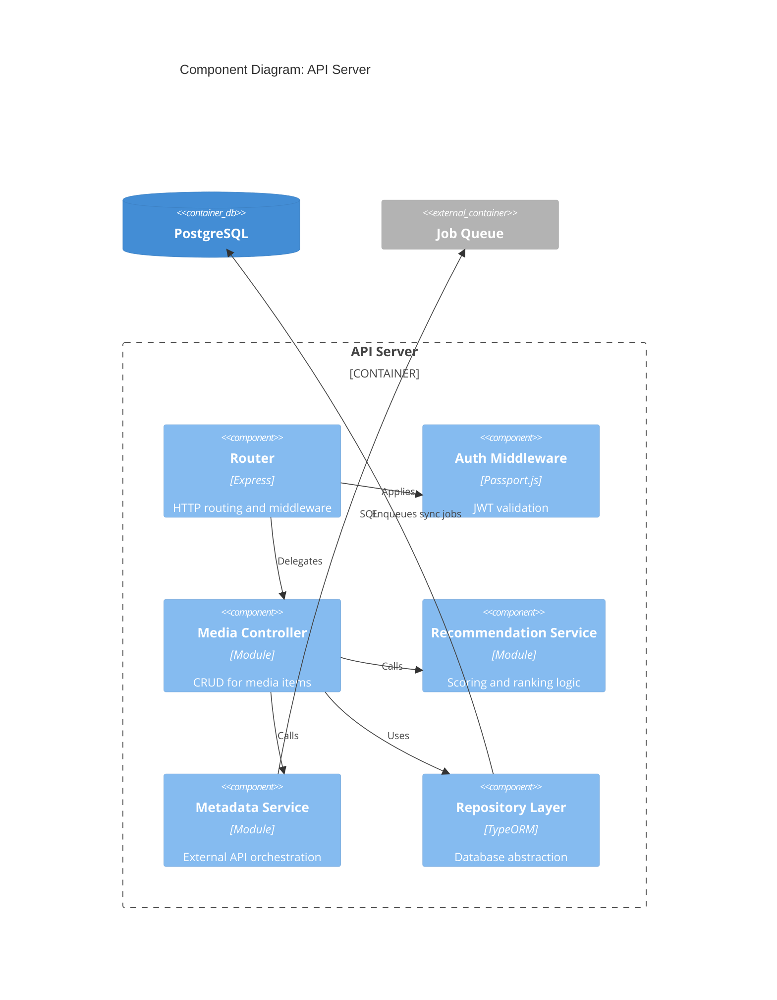
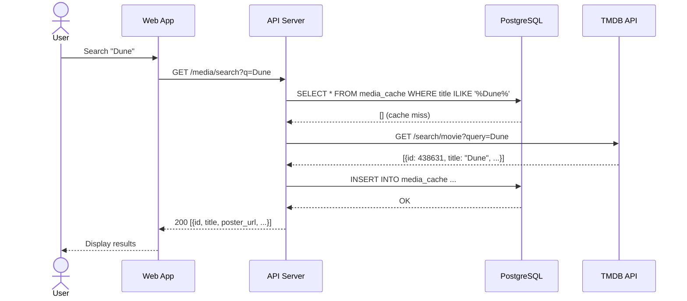
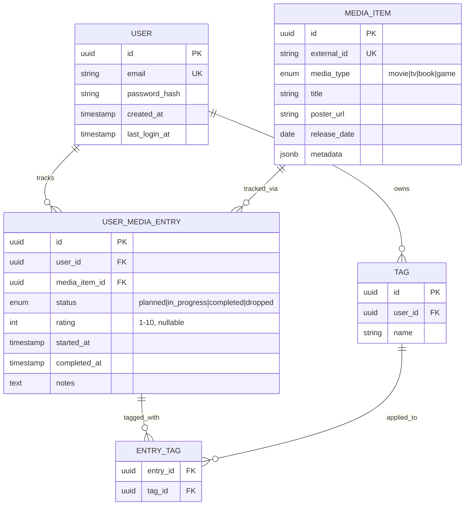
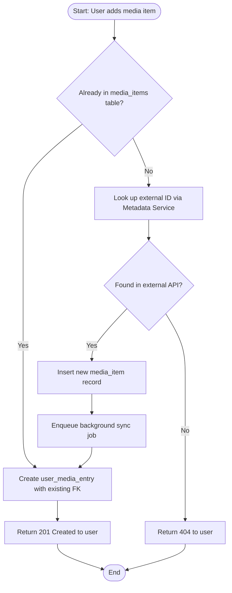
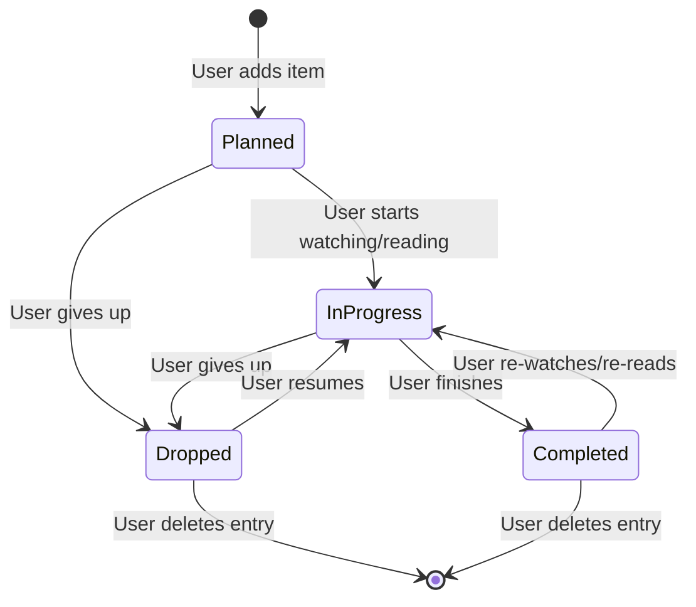

# Architecture Diagrams — Mermaid Patterns

All diagrams in this skill use Mermaid syntax. Claude renders them in `mermaid` code fences.

---

## 1. System Context Diagram (C4 Level 1)

Shows the system and its relationships to users and external systems. No internal details.

**Use when**: introducing the system to stakeholders, scoping a design review.

---

## 2. Container Diagram (C4 Level 2)

Zooms into the system boundary to show containers (apps, services, databases).

**Use when**: designing or reviewing the overall deployment topology.

---

## 3. Component Diagram (C4 Level 3)

Internal structure of a single container. Shows major classes/modules.

**Use when**: reviewing a service's internal design or planning a refactor.

---

## 4. Sequence Diagram

Shows the time-ordered interactions for a specific user journey.

**Use when**: designing async flows, documenting API contracts, tracing bugs.

---

## 5. Entity Relationship Diagram (ERD)

Shows the data model: entities, attributes, and relationships.

**Use when**: designing or reviewing the database schema.

---

## 6. Flowchart (Decision / Process Flow)

Shows a process with decisions and branching paths.

**Use when**: documenting complex business logic or decision trees.

---

## 7. State Diagram

Shows the lifecycle of an entity through its valid states.

**Use when**: designing finite state machines, API status fields, or workflow engines.

---

## Diagram Selection Guide

| Situation | Use |
|-----------|-----|
| Explaining the system to stakeholders | Context Diagram |
| Reviewing deployment topology | Container Diagram |
| Refactoring a service internally | Component Diagram |
| Designing an API flow | Sequence Diagram |
| Reviewing or designing the data model | ERD |
| Documenting a business process | Flowchart |
| Designing a status field or workflow | State Diagram |
