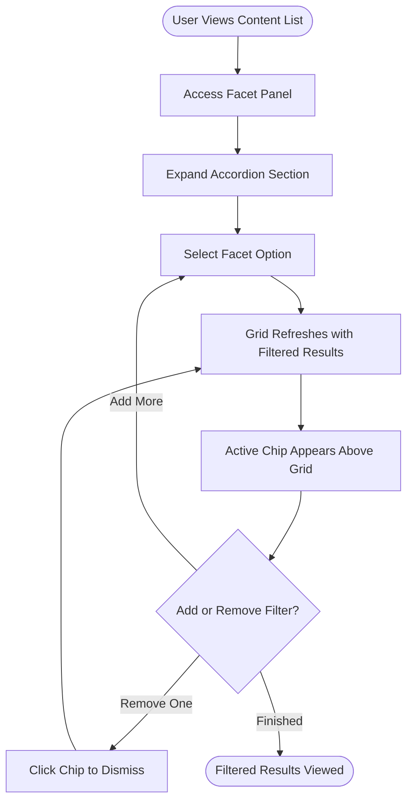
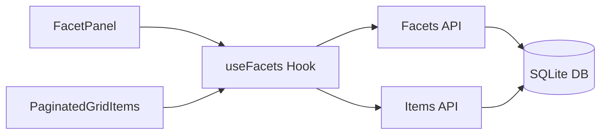
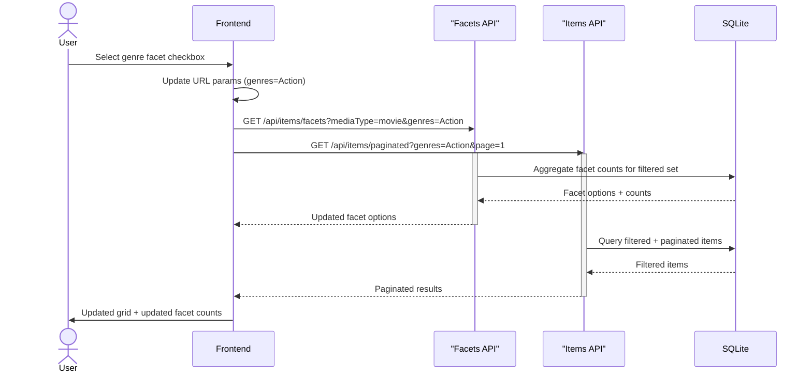

# PRD: Content List Facets

## Introduction

Add a multi-dimensional facet filter panel to content list pages so users can discover media by narrowing results across six dimensions: genre, release year range, rating range, language, creator (director/author/developer), and publisher (games only). Currently, users can only filter by broad status categories (seen, watchlist, etc.) and a single sort order. Facets give users fine-grained control, show item counts per option, and support multi-select with all state persisted in the URL for shareable filtered views. Sorting (via the existing `OrderByComponent`) remains in the toolbar alongside facet controls and stays fully functional when facets are active — `orderBy` and `sortOrder` URL params are preserved by all facet setters. The panel follows a mobile-first responsive approach: a bottom sheet drawer on mobile, a persistent collapsible sidebar on desktop. Integration targets `ItemsPage`, `WatchlistPage`, `UpcomingPage`, and `InProgressPage`; `ListPage` (custom lists) is explicitly deferred due to its different data architecture. On mixed-content pages (Watchlist, Upcoming, In Progress), the panel additionally shows a **Media Type** facet so users can narrow by movie/TV/game/etc. Facet selections (genre, year, language, rating) persist when navigating between media-type pages.

## Goals

- Enable multi-select faceted filtering across 6 dimensions: genre, release year range, TMDB rating range, language, creator (director for movies, creator for TV, author for books/audiobooks, developer for games), and publisher (games only)
- Display item counts per facet option so users understand result density before selecting
- Persist all facet state in URL parameters for bookmarkable and shareable filtered views
- Deliver a mobile-first responsive design: bottom drawer on mobile, sidebar on desktop
- Integrate into `ItemsPage`, `WatchlistPage`, `UpcomingPage`, and `InProgressPage`
- Show a Media Type facet dimension on mixed-content pages (Watchlist, Upcoming, In Progress)
- Persist genre/year/language/rating facet selections across navigation between media-type pages
- Surface active facet selections as removable chips above the grid
- Preserve full compatibility with the existing `OrderByComponent` sort controls — all 10 `MediaItemOrderBy` fields and both `SortOrder` directions remain functional when facets are active; sort state (`orderBy`, `sortOrder`) is carried forward by all facet URL param writes

## User Stories

### US-001: Backend facet counts API endpoint
**Description:** As a developer, I need a backend API endpoint that returns available facet options with item counts so the facet panel can display meaningful, dynamic choices.

**Acceptance Criteria:**
- [ ] `GET /api/items/facets` endpoint exists and returns `{ genres, years, languages, creators, publishers, mediaTypes }` each as `Array<{ value: string; count: number }>`
- [ ] Endpoint accepts optional `mediaType` query param; when provided, scopes results to that type; when absent (mixed-content pages), aggregates across all types
- [ ] `mediaTypes` dimension is populated only when `mediaType` is NOT provided (single-type pages have no use for a media type facet)
- [ ] Endpoint accepts the same filter params as `GET /api/items/paginated` (search, filter, existing genre/year/language/creator/publisher facets) so counts reflect the currently filtered set
- [ ] Each dimension is sorted by count descending
- [ ] Options with zero counts are excluded from the response
- [ ] `years` dimension returns individual year values (derived from `releaseDate`)
- [ ] `creators` dimension aggregates from the appropriate field per media type: `director` for movies, `creator` for TV, `authors` (CSV) for books/audiobooks, `developer` for games; on mixed-content pages (no `mediaType` param), aggregates all four columns into a single union list labeled "Creator"
- [ ] `publishers` dimension is populated from the `publisher` field; only present when `mediaType=video_game` or when absent (mixed-content pages); hidden for all other single-type pages
- [ ] Facets query scopes results to the current user's library by joining the same `listItem`/`seen` subqueries used by `getItemsKnexSql` — do not query the raw `mediaItem` table directly (would return other users' data)
- [ ] Typecheck passes

### US-002: Backend multi-facet filtering for paginated items
**Description:** As a developer, I need the paginated items endpoint to accept multi-value and range facet parameters so filtered result sets can be fetched.

**Acceptance Criteria:**
- [ ] `GET /api/items/paginated` accepts `genres` param as comma-separated string (e.g., `genres=Action,Comedy`)
- [ ] `GET /api/items/paginated` accepts `languages` param as comma-separated string
- [ ] `GET /api/items/paginated` accepts `creators` param as comma-separated string
- [ ] `GET /api/items/paginated` accepts `publishers` param as comma-separated string (e.g., `publishers=Nintendo,Sega`)
- [ ] `GET /api/items/paginated` accepts `yearMin` and `yearMax` as integer params filtering by `releaseDate` year
- [ ] `GET /api/items/paginated` accepts `ratingMin` and `ratingMax` as float params (0–10) filtering by `tmdbRating`
- [ ] Multi-value `genres`, `languages`, `creators`, and `publishers` apply OR logic (item matches if it contains any selected value)
- [ ] `yearMin`/`yearMax` and `ratingMin`/`ratingMax` apply as inclusive bounds
- [ ] Items with no `tmdbRating` are excluded when `ratingMin` > 0
- [ ] All new params are optional; omitting them does not change existing behavior
- [ ] `publishers` filter matches against the `publisher` column using an exact equality check (stored as plain string; not CSV); non-game items are unaffected because their `publisher` column is `NULL`
- [ ] Knex query builder uses `LIKE '%genre%'` per selected genre value (OR-chained `orWhere`) — the `genres` column is a **comma-separated string** (not JSON); existing code in `items.ts` uses this same pattern for the current single-value `genre` filter
- [ ] Typecheck passes

### US-003: FacetPanel desktop sidebar layout
**Description:** As a user browsing on desktop, I want a persistent facet sidebar so I can adjust filters without losing my place in the list.

**Acceptance Criteria:**
- [ ] `FacetPanel` component renders as a fixed-width sidebar (240px) beside the grid on screens ≥ 1024px
- [ ] Sidebar is always visible on desktop; no button required to open it
- [ ] Each facet dimension renders as a collapsible accordion section with a chevron toggle
- [ ] Sections start collapsed; a section auto-expands when it has active selections
- [ ] "Clear all filters" button appears at the top of the panel only when at least one facet is active
- [ ] Clicking "Clear all" resets all facet URL params and collapses all sections
- [ ] Typecheck passes
- [ ] Verify in browser using Selenium MCP

### US-004: FacetPanel mobile bottom drawer
**Description:** As a user browsing on mobile, I want facets in a bottom drawer so they don't crowd the limited screen space.

**Acceptance Criteria:**
- [ ] On screens < 1024px, FacetPanel is hidden by default
- [ ] A "Filters" button is visible in the list toolbar area (near the existing FilterBy/OrderBy controls)
- [ ] When any facet is active, the Filters button shows a badge with the count of active facet dimensions
- [ ] Tapping "Filters" opens a bottom sheet drawer with the full FacetPanel content
- [ ] Drawer has a visible "Close" button at the top and closes on backdrop tap
- [ ] Selecting a facet inside the drawer immediately updates the background grid (no "Apply" button)
- [ ] Drawer is scrollable if facet content exceeds viewport height
- [ ] Typecheck passes
- [ ] Verify in browser using Selenium MCP

### US-005: Genre facet section
**Description:** As a user, I want to filter by one or more genres so I can find content I'm in the mood for.

**Acceptance Criteria:**
- [ ] Genre accordion section lists up to 15 genres as checkbox items, each with a count badge
- [ ] Genres are sorted by count descending
- [ ] A "Show more" link expands the list to show all genres; "Show less" collapses back to 15
- [ ] Multiple genres can be checked simultaneously (OR logic — item matches if it belongs to any selected genre)
- [ ] Checked items are visually distinct (filled checkbox + accent color)
- [ ] Count badges update when other facets change (React Query refetch on facet param change)
- [ ] Selecting a genre updates URL param `genres` as comma-separated values and resets page to 1
- [ ] Typecheck passes
- [ ] Verify in browser using Selenium MCP

### US-006: Year range facet section
**Description:** As a user, I want to filter by release year range so I can browse content from a specific era.

**Acceptance Criteria:**
- [ ] Year accordion section shows a dual-handle range slider [1] spanning from the earliest available year to the current year
- [ ] Two numeric inputs below the slider show the current `yearMin` and `yearMax` values
- [ ] Dragging either slider handle updates the corresponding numeric input in real-time
- [ ] Typing directly into either numeric input updates the slider on blur
- [ ] URL params `yearMin` and `yearMax` are written on slider release (not on every drag step)
- [ ] Input values are clamped to the available year range; invalid inputs revert to the nearest valid value
- [ ] Typecheck passes
- [ ] Verify in browser using Selenium MCP

### US-007: Rating range facet section
**Description:** As a user, I want to filter by TMDB rating range so I can find highly-rated content.

**Acceptance Criteria:**
- [ ] Rating accordion section shows a dual-handle range slider from 0 to 10 with 0.5-step increments
- [ ] Two numeric inputs show current `ratingMin` and `ratingMax` values (e.g., "6.5" – "10.0")
- [ ] Dragging either slider handle updates its numeric input in real-time
- [ ] Typing directly into a numeric input updates the slider on blur; values clamped to 0–10
- [ ] URL params `ratingMin` and `ratingMax` are written on slider release
- [ ] Items with no `tmdbRating` are excluded from results when `ratingMin` > 0
- [ ] Typecheck passes
- [ ] Verify in browser using Selenium MCP

### US-008: Language facet section
**Description:** As a user, I want to filter by language so I can find content in my preferred language.

**Acceptance Criteria:**
- [ ] Language accordion section lists available languages as checkbox items with count badges
- [ ] Language codes from the `language` field are mapped to display names (e.g., `en` → "English", `fr` → "French")
- [ ] Multiple languages can be selected simultaneously (OR logic)
- [ ] Selecting a language updates URL param `languages` as comma-separated values and resets page to 1
- [ ] Section is hidden when only one language is present (no filtering value)
- [ ] Typecheck passes
- [ ] Verify in browser using Selenium MCP

### US-009: Add `creator` field for TV shows (backend schema + metadata)
**Description:** As a developer, I need to store TV show creators in the database so the creator facet can work for TV content.

**Acceptance Criteria:**
- [ ] New migration adds a `creator` column (`STRING`, nullable) to the `mediaItem` table
- [ ] `creator` added to `MediaItemBase` as `creator?: string` and to `mediaItemColumns` in `/server/src/entity/mediaItem.ts`
- [ ] `mapTvShow()` in `/server/src/metadata/provider/tmdb.ts` maps `item.created_by?.map(c => c.name).join(', ')` to `tvShow.creator` (the `created_by: CreatedBy[]` field is already present in every `TvDetailsResponse` — data has been fetched but discarded until now)
- [ ] `creator` is serialized/deserialized consistently as a plain string (same as `developer`, not as a CSV array)
- [ ] Existing TV items in the database are not backfilled automatically (on next metadata refresh they will populate)
- [ ] Typecheck passes

### US-010: Add `director` field for movies (backend schema + metadata)
**Description:** As a developer, I need to store movie directors in the database so the creator facet can work for movies.

**Acceptance Criteria:**
- [ ] New migration adds a `director` column (`STRING`, nullable) to the `mediaItem` table
- [ ] `director` added to `MediaItemBase` as `director?: string` and to `mediaItemColumns`
- [ ] `TMDbMovie.details()` call in `/server/src/metadata/provider/tmdb.ts` is updated to include `append_to_response: 'credits'` in the request params
- [ ] `TMDbApi.MovieDetailsResponse` type is extended with `credits?: { crew: TMDbApi.Crew[] }` (the `Crew` interface already exists in the file at lines ~457–469)
- [ ] `mapMovie()` maps `item.credits?.crew?.filter(c => c.job === 'Director').map(c => c.name).join(', ')` to `movie.director`
- [ ] `director` is serialized as a plain string (may contain comma-separated names when co-directed)
- [ ] Typecheck passes

### US-011: Creator facet section (all media types)
**Description:** As a user, I want to filter by the creator of the content to browse a specific person's body of work across all media types.

**Acceptance Criteria:**
- [ ] Section label is context-aware: "Director" for movies, "Creator" for TV shows, "Author" for books and audiobooks, "Developer" for games
- [ ] Creator section is hidden when the current media type has no creator data (edge case: new TV/movie items added before their metadata refreshed)
- [ ] Checkbox list with count badges, up to 15 most-common with "Show more / Show less" toggle
- [ ] Multiple creators can be selected simultaneously (OR logic)
- [ ] Selecting a creator updates URL param `creators` as comma-separated values and resets page to 1
- [ ] Typecheck passes
- [ ] Verify in browser using Selenium MCP

### US-012: Status facet section (replaces FilterBy)
**Description:** As a user, I want to filter by status (seen, watchlist, rated) inside the facet panel so I don't need a separate filter dropdown.

**Acceptance Criteria:**
- [ ] Status accordion section renders checkboxes: "Rated", "Unrated", "On watchlist", and a media-type-aware seen label ("Watched" for movies/TV, "Played" for games, "Read" for books, "Listened" for audiobooks)
- [ ] Multiple status values can be checked simultaneously (AND logic — item must match all checked statuses)
- [ ] Selecting statuses updates a new `status` URL param as comma-separated keys (e.g., `status=rated,watchlist`); internal keys: `rated`, `unrated`, `watchlist`, `seen`
- [ ] Backend maps `status` keys to existing boolean flags: `rated` → `onlyWithUserRating`, `unrated` → `onlyWithoutUserRating`, `watchlist` → `onlyOnWatchlist`, `seen` → `onlySeenItems`
- [ ] When `showFacets={true}`, `FilterByComponent` is **not rendered** in the toolbar — the Status facet section replaces it entirely
- [ ] When `showFacets={false}` (e.g. statistics pages), the existing `FilterByComponent` continues to render unchanged — no regression
- [ ] The existing `filter` URL param is preserved for backward compatibility; if `filter` is present and `status` is absent, backend treats it as before
- [ ] Typecheck passes
- [ ] Verify in browser using Selenium MCP

### US-013: Active facet chips row
**Description:** As a user, I want to see my active filters at a glance above the grid and be able to remove any of them individually.

**Acceptance Criteria:**
- [ ] A horizontal row of chips renders between the toolbar and the grid when at least one facet is active
- [ ] Each chip shows the dimension label and value, e.g., "Genre: Action", "Year: 2010–2020", "Rating: 7–10"
- [ ] Year and rating ranges each produce a single chip showing the range
- [ ] Clicking the × on a chip removes that specific facet selection, updates URL params, and resets page to 1
- [ ] A "Clear all" button at the end of the chip row resets all facets and URL params
- [ ] The chip row is hidden when no facets are active (no empty space left behind)
- [ ] Typecheck passes
- [ ] Verify in browser using Selenium MCP

### US-014: `useFacets` hook and PaginatedGridItems integration
**Description:** As a developer, I need all facet state managed through a single hook and the FacetPanel wired into the existing list component so every content list page can opt in.

**Acceptance Criteria:**
- [ ] `useFacets()` hook exists and reads/writes `genres`, `yearMin`, `yearMax`, `ratingMin`, `ratingMax`, `languages`, `creators`, `publishers`, `status` URL params
- [ ] `useFacets()` returns: active facet query params (for API calls), a derived `activeFacetCount` number, and setter functions per dimension (including `setPublishers`)
- [ ] `PaginatedGridItems` accepts a new optional `showFacets?: boolean` prop; when `true`, renders the FacetPanel alongside the grid
- [ ] `ItemsPage` and `WatchlistPage` pass `showFacets={true}` to `PaginatedGridItems`
- [ ] `UpcomingPage` and `InProgressPage` pass `showFacets={true}` if confirmed to use `PaginatedGridItems`; if they have a different data-fetching architecture (same constraint as `ListPage`), they are deferred and a follow-up ticket is filed
- [ ] On mixed-content pages (`WatchlistPage`, `UpcomingPage`, `InProgressPage`), `useFacets` passes no `mediaType` to the facets API; the Media Type facet section is rendered; the creator section shows the union of all creator fields labeled "Creator"
- [ ] When navigating from one single-type page to another (e.g. `/movies` → `/tv`), `genres`, `yearMin`, `yearMax`, `ratingMin`, `ratingMax`, `languages`, `orderBy`, and `sortOrder` URL params are carried forward via the Nav link construction; `creators`, `publishers`, and `status` params are dropped on cross-type navigation (`creators` field source changes, `publishers` is games-specific, status labels change)
- [ ] Any facet change resets pagination to page 1 by invoking the existing `handleArgumentChange` callback (same mechanism used by `useOrderByComponent`)
- [ ] Both `/api/items/facets` and `/api/items/paginated` are called in parallel (two separate `useQuery` calls) when facet params change; `keepPreviousData: true` applied to both to prevent flash of empty state during refetch
- [ ] Facet param setters preserve all existing URL params (`orderBy`, `sortOrder`, `filter`, `search`, etc.) when writing — use a merge strategy, not overwrite; `orderBy` and `sortOrder` must never be dropped by a facet setter
- [ ] A new `useMultiValueSearchParam` hook (separate from the existing scalar `useUpdateSearchParams`) handles reading/writing comma-separated multi-value params for `genres`, `languages`, `creators`, and `publishers`
- [ ] Typecheck passes

### US-015: Media Type facet section (mixed-content pages)
**Description:** As a user browsing my watchlist or upcoming items, I want to filter by media type so I can see only movies, or only books, without leaving the page.

**Acceptance Criteria:**
- [ ] Media Type accordion section renders on mixed-content pages (`WatchlistPage`, `UpcomingPage`, `InProgressPage`) when facets are enabled
- [ ] Section is **not rendered** on single-type pages (`ItemsPage` — already scoped to one media type)
- [ ] Each media type present in the user's library is shown as a checkbox with display label and count (e.g., "Movie (42)", "TV Show (18)", "Book (5)")
- [ ] Display labels use the existing media type label mapping already present in the codebase (not raw enum values like `video_game`)
- [ ] Multiple types can be selected simultaneously (OR logic)
- [ ] Selecting types updates URL param `mediaTypes` (comma-separated, e.g., `mediaTypes=movie,tv`) and resets page to 1
- [ ] `GET /api/items/paginated` accepts `mediaTypes` as comma-separated string; filters items to only those matching any selected type
- [ ] Typecheck passes
- [ ] Verify in browser using Selenium MCP

### US-016: Author and creator field normalization
**Description:** As a developer, I need all incoming author and creator names to be normalized before storing, so the creator facet produces clean, deduplicated tokens when aggregating.

**Acceptance Criteria:**
- [ ] A shared utility function `normalizeCreatorField(names: string[]): string[]` exists in `/server/src/utils/normalizeCreators.ts` and performs: trim whitespace from each name, filter empty strings, deduplicate while preserving order
- [ ] The function is applied before `join(',')` in all three storage sites: OpenLibrary `mapBook()`, Audible `mapAudiobook()`, and the Goodreads import controller
- [ ] **Research confirmed (no "Last, First" format found):** All three sources — Goodreads (`goodreads.xml` fixture: "Fyodor Dostoevsky", "J.K. Rowling"), OpenLibrary (`author_name: string[]`), and Audible (`author.name` from objects) — return names in "First Last" format. No "Last, First" conversion is required.
- [ ] A `splitCreatorField(csv: string | null): string[]` utility splits a stored CSV creator string on `,` and trims each token, filtering empty results; used by the facets aggregation query for `authors`, `director`, and `creator` fields
- [ ] `splitCreatorField` is used (not raw `.split(',')`) everywhere stored creator CSV values are expanded: `mediaItem.ts` deserialization, `items.ts` mapRawResult, `details.ts` deserialization
- [ ] Unit tests cover: multiple authors, single author, empty string, null, names with leading/trailing whitespace, and the confirmed "First Last" format
- [ ] Typecheck passes

### US-017: Sort order compatibility with facets
**Description:** As a developer, I need the existing sort controls to remain fully functional when facets are enabled so that users can sort and filter simultaneously without losing their sort preference.

**Acceptance Criteria:**
- [ ] `OrderByComponent` continues to render in the `PaginatedGridItems` toolbar when `showFacets={true}` — it is **not** removed or relocated
- [ ] On mobile, the sort direction toggle button (`↑`/`↓`) and the sort field menu remain accessible in the toolbar alongside the new "Filters" button
- [ ] All 10 `MediaItemOrderBy` sort fields (`title`, `releaseDate`, `lastSeen`, `status`, `mediaType`, `progress`, `recommended`, `nextAiring`, `lastAiring`, `unseenEpisodes`) remain available and functional when facets are active
- [ ] Both `SortOrder` directions (`asc`, `desc`) work correctly in combination with any active facet selection
- [ ] `orderBy` and `sortOrder` URL params are explicitly included in the merge strategy used by all `useFacets` setter functions — they are never dropped when a facet param is written
- [ ] `useFacets` param setters spread all current `searchParams` entries (including `orderBy` and `sortOrder`) before writing the new facet value; no setter calls `setSearchParams` with a bare object
- [ ] Any sort change invokes `handleArgumentChange` to reset pagination to page 1 — this is the existing behavior in `useOrderByComponent` and must not be broken
- [ ] Changing a facet does **not** reset `orderBy` or `sortOrder` to their defaults
- [ ] Typecheck passes

### US-018: Add `publisher` field for games (backend schema + metadata)
**Description:** As a developer, I need to store game publisher names in the database so the publisher facet can work for video game content.

**Acceptance Criteria:**
- [ ] New migration adds a `publisher` column (`STRING`, nullable) to the `mediaItem` table
- [ ] `publisher` added to `MediaItemBase` as `publisher?: string` and to `mediaItemColumns` in `/server/src/entity/mediaItem.ts`
- [ ] `mapGame()` in `/server/src/metadata/provider/igdb.ts` maps the publisher name from `involved_companies` (entries where `publisher === true`) to `game.publisher`; when multiple publishers exist, their names are joined with `', '`
- [ ] `publisher` is serialized as a plain string (same pattern as `developer`, not a CSV array)
- [ ] Existing game items are not backfilled automatically — publisher populates on next metadata refresh
- [ ] Typecheck passes

### US-019: Publisher facet section (games)
**Description:** As a user browsing games, I want to filter by publisher so I can browse a specific company's catalog.

**Acceptance Criteria:**
- [ ] Publisher accordion section renders inside `FacetPanel` only when `mediaType=video_game` or on mixed-content pages where at least one game publisher value exists
- [ ] Section is **not rendered** on any other single-type page (movies, TV, books, audiobooks)
- [ ] On mixed-content pages the section header reads "Publisher"; on the games page it also reads "Publisher"
- [ ] Section lists available publishers as checkbox items with count badges, up to 15 most-common with "Show more / Show less" toggle (same `ExpandableList` component used by creator and genre sections)
- [ ] Publishers are sorted by count descending
- [ ] Multiple publishers can be selected simultaneously (OR logic)
- [ ] Selecting a publisher updates URL param `publishers` as comma-separated values and resets page to 1
- [ ] Count badges update reactively when other facets change (React Query refetch on facet param change)
- [ ] Section is hidden when no publisher data is present (all games added before next metadata refresh)
- [ ] Typecheck passes
- [ ] Verify in browser using Selenium MCP

## Functional Requirements

- **FR-1:** `GET /api/items/facets` returns `{ genres, years, languages, creators, publishers, mediaTypes }` with per-option counts. When `mediaType` is provided, scopes all dimensions to that type and omits `mediaTypes`. When absent, aggregates across all types and includes `mediaTypes`. Creator aggregation uses `splitCreatorField()` to expand CSV author names and unions `director`, `creator`, `authors`, `developer` fields. `publishers` dimension is populated from the `publisher` column; included when `mediaType=video_game` or when no `mediaType` is provided.
- **FR-2:** `GET /api/items/paginated` accepts `genres`, `languages`, `creators`, `publishers`, `mediaTypes` (comma-separated), `yearMin`, `yearMax`, `ratingMin`, `ratingMax` as optional query params.
- **FR-3:** Multi-value facet params (`genres`, `languages`, `creators`, `publishers`) apply OR logic per dimension; all active dimensions combine with AND logic (e.g., genres=Action AND language=English).
- **FR-4:** Year and rating ranges are inclusive bounds. Items outside the range are excluded. Items with no `tmdbRating` are excluded when `ratingMin` > 0.
- **FR-5:** `FacetPanel` renders as a 240px sidebar beside the grid on screens ≥ 1024px and as a bottom sheet drawer on screens < 1024px.
- **FR-6:** Each facet dimension is a collapsible accordion section [2] (collapsed by default; auto-expands when the section has active selections).
- **FR-7:** Genre, language, creator, and publisher sections render checkbox lists with count badges, sorted by count descending, with a "Show more / Show less" toggle at 15 items.
- **FR-8:** Year and rating sections render dual-handle range sliders [1] with paired numeric inputs; URL params update on slider release.
- **FR-9:** New `creator` (TV), `director` (movie), and `publisher` (games) columns are added to `mediaItem` via migrations and populated from their respective metadata providers (TMDB for TV/movie, IGDB for games) during the standard details fetch. No backfill of existing items is required.
- **FR-10:** Creator section renders for all media types with a context-aware label: "Director" (movies), "Creator" (TV), "Author" (books/audiobooks), "Developer" (games). Section is hidden only when no data is present for the current type.
- **FR-11:** A Status facet section renders checkboxes for: Rated, Unrated, On watchlist, and a media-type-aware seen label. Values use AND logic. Selected values are stored in the `status` URL param (comma-separated keys: `rated`, `unrated`, `watchlist`, `seen`). Backend maps each key to the corresponding boolean flag (`onlyWithUserRating`, `onlyWithoutUserRating`, `onlyOnWatchlist`, `onlySeenItems`). `FilterByComponent` is not rendered in the toolbar when `showFacets={true}`.
- **FR-12:** Active facet chips render above the grid when any facet is active; each chip is individually dismissible; "Clear all" resets all facets.
- **FR-13:** All facet state persists in URL params (`genres`, `yearMin`, `yearMax`, `ratingMin`, `ratingMax`, `languages`, `creators`, `publishers`, `status`, `mediaTypes`). The legacy `filter` param remains supported for backward compatibility but is not written by the new facet panel.
- **FR-14:** Any facet change resets pagination to page 1.
- **FR-15:** The mobile "Filters" button shows a badge with the count of active facet dimensions (including active status selections) when filters are active.
- **FR-16:** `PaginatedGridItems` accepts `showFacets?: boolean` prop; `ItemsPage`, `WatchlistPage`, `UpcomingPage`, and `InProgressPage` pass `true` (pending architecture confirmation for the latter two). `ListPage` is explicitly out of scope.
- **FR-17:** On mixed-content pages (no `mediaType`), the FacetPanel renders a **Media Type** accordion section listing all media types present in the user's library with counts (e.g., "Movie (42)", "TV Show (18)"). Selecting one or more filters the grid to those types (OR logic). URL param: `mediaTypes` (comma-separated).
- **FR-18:** Nav links between single-type pages (`/movies`, `/tv`, `/games`, `/books`, `/audiobooks`) carry forward `genres`, `yearMin`, `yearMax`, `ratingMin`, `ratingMax`, `languages`, `orderBy`, and `sortOrder` from the current URL; `creators`, `publishers`, and `status` are dropped on cross-type navigation (`publishers` is games-specific; `creators` and `status` labels change per type).
- **FR-19:** A Publisher facet section renders in `FacetPanel` when `mediaType=video_game` or on mixed-content pages where game items with publisher data are present. Section header is "Publisher". Checkbox list with count badges, up to 15 items with "Show more / Show less". Multiple publishers can be selected simultaneously (OR logic). URL param: `publishers` (comma-separated). `useFacets` reads/writes `publishers` alongside the other facet params. Section is hidden when no publisher data is present.
- **FR-20:** Sorting remains fully compatible with all facet selections. `OrderByComponent` renders in the `PaginatedGridItems` toolbar regardless of `showFacets` value. All 10 `MediaItemOrderBy` fields and both `SortOrder` directions operate independently of facet state. `orderBy` and `sortOrder` are included in the merge strategy for all `useFacets` setter writes and are carried forward in cross-type nav links (FR-18). The sort controls are never reset or removed by facet interactions.

## Non-Goals

- No saved/named filter sets or filter history
- No AND logic within a single facet dimension (multi-select is always OR within a dimension)
- No facet panel on `/calendar` page
- No facets on `UpcomingPage`/`InProgressPage` if those pages do not use `PaginatedGridItems` — integration requires the same refactor path as `ListPage` and is tracked as a follow-up if confirmed
- No animated transitions for drawer open/close (functional behavior only; can be enhanced later)
- No custom sort order for facet options (always count descending — this refers to the ordering of options *within* the facet panel, not the grid sort order)
- No changes to the `OrderByComponent` UI or the `MediaItemOrderBy` / `SortOrder` types — sorting behavior is preserved as-is (FR-20)
- No removal of `FilterByComponent` from statistics pages — `FilterBy` is only suppressed when `showFacets={true}`, and statistics pages use `showFacets={false}` (i.e. no regression on stats pages)
- No facets on the Statistics sub-pages (those have their own year/genre navigation)
- No facets on `ListPage` (custom lists) in this release — `ListPage` uses a different data-fetching architecture and requires a separate design
- No backfill of existing movie/TV/game items with `director`/`creator`/`publisher` data — new fields populate on next metadata refresh only
- No `narrators` as a separate facet dimension for audiobooks — narrators are fetched and stored but the facet will use `authors` for the creator dimension
- No `developer` as a separate facet dimension for games — developer is covered by the creator facet; publisher is a separate dimension (FR-19)

## Design Considerations

- Match the existing TailwindCSS dark theme used throughout the app; use the existing `accent` color for checked states.
- On desktop, the grid area shrinks to accommodate the sidebar (flex layout: sidebar + grid in a row).
- On mobile, the FacetPanel content inside the drawer matches the sidebar layout (same accordion structure).
- The "Filters" button on mobile should visually match the existing `OrderBy` button style (since `FilterBy` is replaced by the facet panel).
- Active chips row should use a horizontally scrollable container on mobile to avoid wrapping.
- Accordion chevrons should rotate 180° when expanded (CSS transform, no JS animation required).
- Language codes should be mapped using the browser's `Intl.DisplayNames` API for zero-bundle-size locale name resolution.

## Technical Considerations

- Use `@radix-ui/react-slider` [1] for the dual-handle year and rating range sliders — it provides accessible, unstyled primitives that work well with TailwindCSS.
- Use `@radix-ui/react-collapsible` [2] for accordion sections — provides keyboard navigation and ARIA attributes out of the box, satisfying the accessible disclosure pattern [3].
- **Genres column is CSV, not JSON.** The `genres` column stores a plain comma-separated string (e.g., `"Action,Drama"`), serialized via `genres.join(',')` and deserialized via `.split(',')` throughout the codebase (confirmed in `mediaItem.ts` and `statisticsController.ts`). Do not use `json_each()` directly on the column — it requires a fragile JSON-wrapping hack that breaks on genre names containing double-quote characters. For the facets aggregation query, use application-layer splitting (fetch rows, split in TypeScript), mirroring the pattern already used in `statisticsController.ts`. For the multi-value `genres` filter in the items query, use OR-chained `LIKE '%value%'` per genre, consistent with the existing single-value `genre` filter already in `items.ts`.
- **Existing `year` param conflict.** The existing `year` URL param filters by *seen date year* (not release year). The new `yearMin`/`yearMax` facet params filter by `releaseDate` year. Both coexist — do not rename or shadow the existing `year` param. The `GetItemsArgs` type must add `yearMin`/`yearMax` as new optional fields.
- **Existing `genre` param coexistence.** The existing singular `genre` param performs a single-value LIKE filter. The new plural `genres` param is multi-value OR logic. Both must be handled independently in the controller and query builder.
- **Creator field availability by media type (confirmed by API research):**

  | Media Type | Field | Source | Status | Notes |
  |---|---|---|---|---|
  | Movie | `director` | TMDB `/3/movie/{id}?append_to_response=credits` | Not stored — needs `append_to_response=credits` added to existing details call in `tmdb.ts` | `Crew` type already defined in file; filter `crew` by `job === 'Director'`; store as plain string |
  | TV Show | `creator` | TMDB `TvDetailsResponse.created_by[]` | Not stored — data **already fetched** but silently discarded in `mapTvShow()` | One line to add: `tvShow.creator = item.created_by?.map(c => c.name).join(', ')` |
  | Book | `authors` | OpenLibrary `author_name[]` in search response | **Already stored** as CSV string | Authors populated via search path; details path only has key refs, not names |
  | Audiobook | `authors` | Audible `contributors.authors[].name` | **Already stored** as CSV string | `narrators` is also stored separately but not used for creator facet |
  | Video Game | `developer` | IGDB `involved_companies` (developer flag) | **Already stored** as plain string | Used for the Creator facet dimension; separate from publisher |
  | Video Game | `publisher` | IGDB `involved_companies` (publisher flag) | Not stored — needs a new migration and mapping in `igdb.ts` | Filter `involved_companies` by `publisher === true`; join names with `', '`; store as plain string |

  Three new columns (`director`, `creator`, `publisher`) are stored as plain strings (same pattern as `developer`, not as CSV arrays like `authors`). New migrations required for each.
- **Author name format confirmed "First Last" across all sources (US-016).** Research confirmed: Goodreads XML stores `<author_name>Fyodor Dostoevsky</author_name>` (single "First Last" string); OpenLibrary returns `author_name: string[]` array in "First Last" format; Audible maps `author.name` from objects in "First Last" format. No "Last, First" conversion is needed. The normalization utility (`normalizeCreatorField`, `splitCreatorField`) adds defensive whitespace trimming and empty-token filtering only.
- **`splitCreatorField` replaces raw `.split(',')`.** A shared utility `splitCreatorField(csv: string | null): string[]` in `/server/src/utils/normalizeCreators.ts` is used everywhere stored creator CSV values are expanded. This ensures consistent trimming of the leading space that appears when joining with `', '` (e.g., `"Christopher Nolan, Emma Thomas".split(',')` → `["Christopher Nolan", " Emma Thomas"]`). All four deserialization sites (`mediaItem.ts`, `items.ts`, `details.ts`, facets aggregation) must use this utility.
- **`useFacets` must use a new `useMultiValueSearchParam` hook** (not the existing scalar `useUpdateSearchParams`) for `genres`, `languages`, `creators`, `publishers`, and `status`. The existing hook is scalar-only — adding array semantics risks breaking its usages in `OrderBy`, pagination, and `useMenuComponent`. The `useFilterBy` hook is no longer called in `PaginatedGridItems` when `showFacets={true}`; its `filter` URL param logic is superseded by the `status` param in `useFacets`.
- **URL param write strategy: always merge.** Every facet setter must spread all existing `searchParams` entries before writing the new value — never call `setSearchParams` with a bare object. This preserves `orderBy`, `sortOrder`, `filter`, `search`, and all other active params when a facet changes. `orderBy` and `sortOrder` must be explicitly included in the merge — they must never be silently dropped by a facet setter. The existing `useOrderByComponent` already handles its own `setSearchParams` writes (via `useUpdateSearchParams`) and will similarly merge existing facet params as long as it continues to use the same merge pattern.
- **`build:routes` required after adding the new controller method.** The server uses `typescript-routes-to-openapi` to auto-generate `routes.ts` and `rest-api/index.ts`. After adding `getFacets` to `ItemsController`, run `npm run build:routes` before the client will have the typed API method.
- **Install `@radix-ui` packages before starting.** Add `@radix-ui/react-slider` and `@radix-ui/react-collapsible` to `client/package.json`. Both declare `react: "^16.8 || ^17.0 || ^18.0 || ^19.0"` as peer deps — React 17 is supported.
- **Mixed-content pages (Watchlist, Upcoming, In Progress) have no `mediaType`.** The facets endpoint with no `mediaType` param aggregates creator fields from all four columns (`director`, `creator`, `authors`, `developer`) into a single union list, split via `splitCreatorField`. The creator section label is "Creator" (generic). The publisher section aggregates from the `publisher` column across all items (non-game items have `NULL`; only game items contribute); the section renders only if at least one publisher value exists. A Media Type facet section is shown instead of being hidden. The `useFacets` hook must also read/write the `mediaTypes` and `publishers` URL params on these pages.
- **Facets query must scope to current user's library.** The facets aggregation must join the same `listItem`/`seen` subqueries that `getItemsKnexSql` uses — do not aggregate the raw `mediaItem` table, which is shared across users.
- The `/api/items/facets` and `/api/items/paginated` calls fire in parallel (two separate `useQuery` calls). Apply `keepPreviousData: true` to both so the UI does not flash empty during refetches. Apply `staleTime: 30000` only to the facets query; items query must always re-fetch on param change.
- The bottom drawer should use `position: fixed; bottom: 0; left: 0; right: 0` with a high `z-index`. Reuse the existing `Portal` component (`/client/src/components/Portal.tsx`) to mount the drawer outside the normal DOM tree.
- Multi-value URL param format: comma-separated string (e.g., `genres=Action,Comedy`). Empty or absent param means "all (no filter)".
- Facet components: `FacetPanel`, `FacetSection`, `FacetCheckboxList`, `FacetRangeSlider`, `ActiveFacetChips`, `ExpandableList` (shared 15-item truncation logic used by genre, language, creator, and publisher sections). All in `/client/src/components/Facets/`.
- Reuse the existing `Checkbox` component (`/client/src/components/Checkbox.tsx`) inside `FacetCheckboxList`.
- All user-facing strings (dimension labels, button text, chip labels) must be wrapped with `@lingui/macro` `t` or `<Trans>` and translation keys added to all 28 language files.
- `useFacets()` hook lives in `/client/src/hooks/facets.ts` and is the single source of truth for reading and writing all facet URL state, including `publishers`. It does **not** own `orderBy` or `sortOrder` — those remain managed exclusively by `useOrderByComponent` to avoid conflicting writes.
- **Sort controls are owned by `useOrderByComponent`, not `useFacets`.** The `useOrderByComponent` hook already reads/writes `orderBy` and `sortOrder` via `useUpdateSearchParams` with the existing merge strategy. No changes to `OrderBy.tsx` or `useOrderByComponent` are required for sort compatibility — the merge requirement (US-017) is enforced at the `useFacets` setter level only.

## System Diagrams

### Diagram Judgment

This PRD includes the following diagrams based on complexity analysis:

- **User Flow:** Included — 5+ sequential steps with 2 decision points (add vs. remove filter, add more vs. finish).
- **Architecture:** Included — 6 components interact across UI, hook, and API layers (FacetPanel, PaginatedGridItems, useFacets, Facets API, Items API, SQLite).
- **Sequence:** Included — 5 participants with parallel async calls (Facets API + Items API fired simultaneously on facet change).

This section visualizes the facet selection user journey, system component relationships, and the parallel API call pattern on facet change.

---

### User Flow: Applying and Removing Facet Filters

This diagram shows the user journey from viewing a content list to applying multi-facet filters and clearing them.

---

### System Architecture: Facet Feature Components

This diagram illustrates how the facet feature components connect, from the UI layer through shared hook state to the backend API and database.

---

### Sequence: Facet Selection Triggers Parallel API Calls

This diagram shows how a facet selection causes both the facets counts endpoint and the items endpoint to be called in parallel, keeping facet counts and grid results in sync.

## Success Metrics

- All 6 facet dimensions function correctly across all supported media types (movies, TV, games, books, audiobooks); publisher section renders correctly on the games page and on mixed-content pages
- Grid updates to reflect facet selections with both the facets and items API responding correctly
- Active facet chips accurately reflect all selected facet values (including publisher) and update on chip dismissal
- URL params correctly encode multi-value genre/language/creator/publisher selections (e.g., `genres=Action,Comedy`, `publishers=Nintendo`) and are restorable from URL
- Sort order (`orderBy`, `sortOrder`) is preserved when facets are applied and cleared; applying or removing any facet does not reset the active sort field or direction
- Mobile drawer opens, displays all facet sections, and closes correctly without layout shifts on small screens

## Open Questions

1. ~~Is the `director` field currently stored for movies?~~ **Resolved:** Not stored, but TMDB already returns it via `append_to_response=credits`. Adding it is MEDIUM effort (new migration + extend `TMDbApi.MovieDetailsResponse` type + one mapping line). Included in this feature as US-010.
2. ~~For TV shows, what is the appropriate "creator" equivalent?~~ **Resolved:** TMDB returns `created_by: CreatedBy[]` in every `TvDetailsResponse` — it is already fetched but discarded in `mapTvShow()`. Adding it is EASY (new migration + one mapping line). Included in this feature as US-009.
3. ~~Should facets coexist with the existing `FilterBy` dropdown, or be absorbed?~~ **Resolved:** `FilterBy` is absorbed into the facet panel as a "Status" section (US-012). `FilterByComponent` is suppressed when `showFacets={true}`; statistics pages are unaffected. A new `status` URL param handles multi-select status state; legacy `filter` param remains for backward compat.
4. ~~Should facets reset on cross-type navigation?~~ **Resolved:** `genres`, `yearMin`, `yearMax`, `ratingMin`, `ratingMax`, `languages`, `orderBy`, and `sortOrder` persist across media-type navigation. `creators`, `publishers`, and `status` are dropped (`creators` field source and status labels change per type; `publishers` is games-specific). Nav links carry the persistent params forward (FR-18).
5. ~~Should `/upcoming` and `/in-progress` get facets?~~ **Resolved:** Yes, included in this feature (FR-16). Both pages pass `showFacets={true}` to `PaginatedGridItems` pending architecture confirmation; deferred only if they don't use `PaginatedGridItems`.
6. ~~Should `ratingMin`/`ratingMax` filter against `tmdbRating`, `userRating`, or both?~~ **Resolved:** `tmdbRating` only. Items without a rating are excluded when `ratingMin` > 0.
7. ~~Should the creator section on mixed-content pages be hidden or show a union?~~ **Resolved:** Show a union of all creator fields (`director`, `creator`, `authors`, `developer`) aggregated into a single "Creator" section. Mixed-content pages also get a new **Media Type** facet section (FR-17, US-001 updated).
8. ~~Are Goodreads `authors` stored in "Last, First" format?~~ **Resolved:** Safe. Goodreads import stores `authors: [item.author_name]` — a single full-name string (e.g., "Stephen King"), not "Last, First" format. No special handling required for the creator facet on books.

## References

*References verified on 2026-03-07*

[1] **@radix-ui/react-slider** [Official Docs]
    Radix UI
    https://www.radix-ui.com/primitives/docs/components/slider
    *Supports: Dual-handle range slider recommendation in Technical Considerations (US-006, US-007)*

[2] **@radix-ui/react-collapsible** [Official Docs]
    Radix UI
    https://www.radix-ui.com/primitives/docs/components/collapsible
    *Supports: Accordion section recommendation in Technical Considerations (US-003, FR-6)*

[3] **WAI-ARIA Authoring Practices — Accordion Pattern** [Spec]
    W3C Web Accessibility Initiative
    https://www.w3.org/WAI/ARIA/apg/patterns/accordion/
    *Supports: Accessible disclosure pattern requirement in Technical Considerations (FR-6)*
