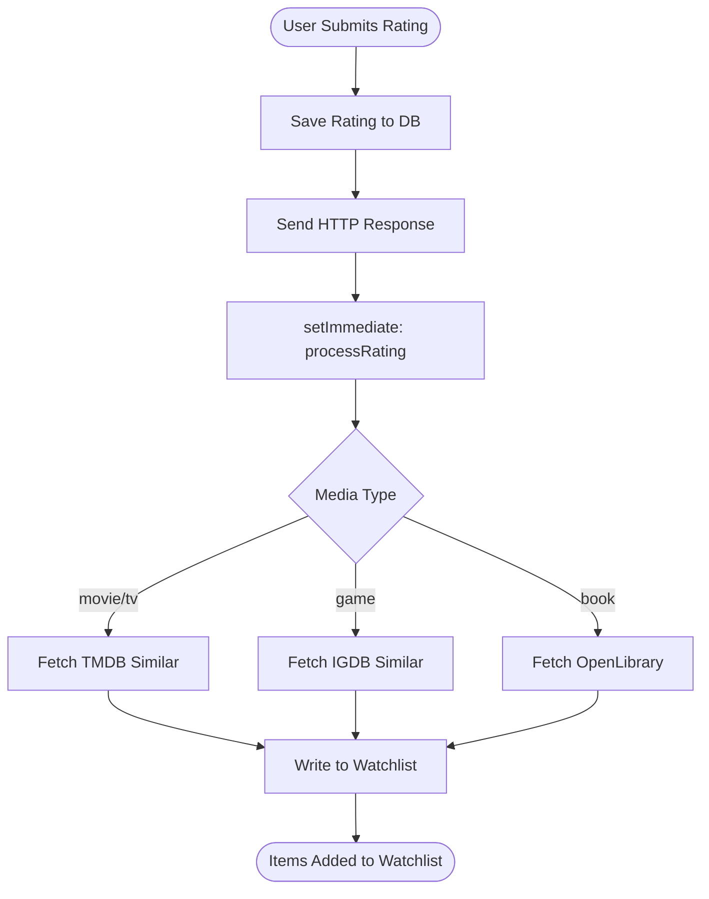
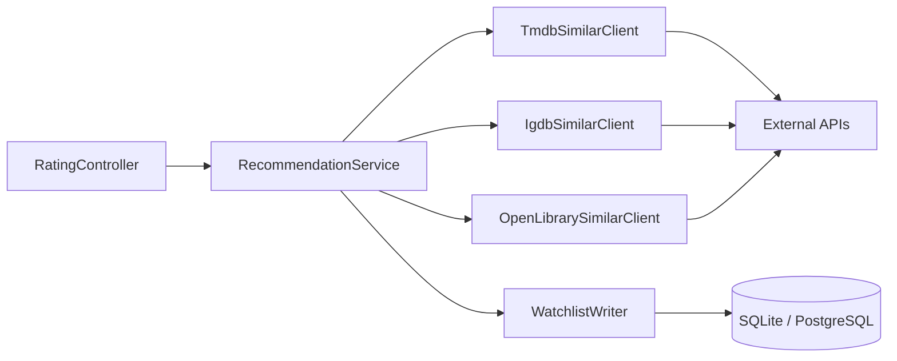
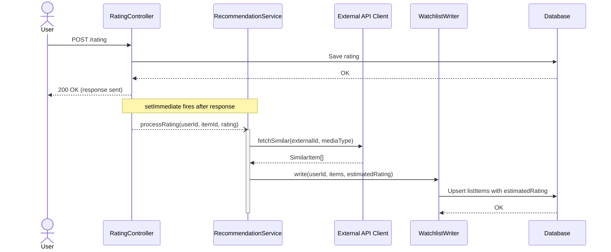

# PRD: upnext Recommendation Engine

## Introduction

The upnext recommendation engine automatically populates a user's watchlist with similar content whenever they submit a rating. When a user rates a movie, TV show, book, or game, the system asynchronously queries external similarity APIs (TMDB `/similar`, IGDB `similar_games`, OpenLibrary subjects) and adds the results to the user's watchlist with an `estimatedRating` field seeded from the user's triggering rating. A new "Recommended" sort order then combines `estimatedRating` with external API quality signals to surface the most relevant unwatched content at the top of the watchlist.

This feature fills a genuine gap: no free, self-hosted, multi-media-type platform currently provides recommendation functionality. The implementation is transparent—similarity endpoints are used (not opaque "recommendation" endpoints) so the recommendation source is always auditable.

---

## Goals

- Automatically populate the watchlist with similar content after every rating event (all media types, any rating value)
- Seed each recommended item with an `estimatedRating` derived from the user's triggering rating
- When the same item is recommended from multiple triggering sources, retain the most conservative (lowest) `estimatedRating`
- Provide a "Recommended" sort order that blends `estimatedRating` and external ratings into a single engagement score
- Process recommendations asynchronously so the rating save HTTP response is never delayed
- Support all four media types: movies, TV shows, books, and games

---

## User Stories

### US-001: Add estimatedRating column to listItem table

**Description:** As a developer, I need a dedicated `estimatedRating` column on the `listItem` table so that recommendation scores persist between sessions and are directly queryable.

**Acceptance Criteria:**
- [ ] Knex migration file created at `server/src/migrations/20990101000000_listItemEstimatedRating.ts`
- [ ] Migration adds `estimatedRating FLOAT NULL` column to the `listItem` table
- [ ] Migration runs successfully on both SQLite and PostgreSQL
- [ ] Running the migration twice is idempotent (uses `knex.schema.hasColumn` guard before `alterTable`)
- [ ] Typecheck passes (`npx tsc --noEmit`)

---

### US-002: Extend ListSortBy type with 'recommended' option

**Description:** As a developer, I need the `ListSortBy` union type to include `'recommended'` so the frontend and API can reference it as a valid sort option.

**Acceptance Criteria:**
- [ ] `'recommended'` added to the `ListSortBy` union in `server/src/entity/list.ts`
- [ ] `estimatedRating?: number` field added to the `ListItem` entity/type definition
- [ ] No existing sort options removed or renamed
- [ ] Typecheck passes

---

### US-003: Fire-and-forget recommendation hook in RatingController

**Description:** As a developer, I need the rating controller to trigger the recommendation engine asynchronously after each rating is saved so that the HTTP response is never delayed.

**Acceptance Criteria:**
- [ ] The following pattern is added in `server/src/controllers/rating.ts` strictly after `res.send()`:
  ```typescript
  setImmediate(() => {
    recommendationService.processRating(userId, itemId, rating).catch((err) => {
      logger.error('Unhandled error in recommendation pipeline', { err });
    });
  });
  ```
- [ ] `.catch()` is used (not `try/catch`) because `processRating` returns `Promise<void>`; a `try/catch` around an async call without `await` does not catch rejected promises
- [ ] The hook fires only after the response has been sent (placement is strictly after `res.send()`)
- [ ] Typecheck passes

---

### US-004: TMDB Similar Movies and TV Shows client

**Description:** As a developer, I need a client that fetches similar movies and TV shows from TMDB so that the recommendation engine can retrieve similarity data for those media types.

**Acceptance Criteria:**
- [ ] `TmdbSimilarClient` implements `fetchSimilar(tmdbId: number, mediaType: 'movie' | 'tv'): Promise<SimilarItem[]>`
- [ ] Calls `GET /3/movie/{id}/similar` for movies and `GET /3/tv/{id}/similar` for TV shows
- [ ] Returns all results from the first page (up to 20 items)
- [ ] Filters out items where `vote_count < 10` before returning
- [ ] On HTTP 429, logs the `Retry-After` header value at `WARN` level and returns an empty array (no retry in v1)
- [ ] On any other non-2xx response, throws a descriptive `Error` including the HTTP status code and endpoint path
- [ ] Reuses the existing TMDB `apiKey` from shared config; does not introduce a new configuration key
- [ ] Typecheck passes

---

### US-005: IGDB Similar Games client

**Description:** As a developer, I need a client that fetches similar games from IGDB using the documented two-step flow so that the recommendation engine can retrieve similarity data for games.

**Acceptance Criteria:**
- [ ] `IgdbSimilarClient` implements `fetchSimilar(igdbId: number): Promise<SimilarItem[]>`
- [ ] Step 1: Queries `POST /v4/games` with `fields similar_games` filter to retrieve similar game IDs for the given game
- [ ] Step 2: Queries `POST /v4/games` with full detail fields (`name`, `total_rating`, `total_rating_count`) for each retrieved similar game ID
- [ ] All requests are throttled using the **shared `RequestQueue` instance** from the existing `IGDB` provider — do not create a separate queue instance, as two independent queues would allow the combined rate to exceed 4 req/sec during concurrent operations
- [ ] `total_rating` (0–100 scale) is divided by 10 to produce a normalized 0–10 `externalRating` value
- [ ] IGDB OAuth token expiry is checked before every call using the following guard (60-second buffer):
  ```typescript
  const expiresAt = tokenAcquiredAt.getTime() + token.expires_in * 1000;
  const needsRefresh = expiresAt - Date.now() < 60_000;
  if (needsRefresh) await refreshToken();
  ```
- [ ] Reuses existing IGDB client credentials from shared config; does not introduce new configuration keys
- [ ] Typecheck passes

---

### US-006: OpenLibrary Subject-based Books client

**Description:** As a developer, I need a client that retrieves related books from OpenLibrary using subject-based search so that the recommendation engine can suggest books even without a dedicated similarity API.

**Acceptance Criteria:**
- [ ] `OpenLibrarySimilarClient` implements `fetchSimilar(workId: string): Promise<SimilarItem[]>`
- [ ] Fetches the work's subjects via `GET https://openlibrary.org/works/{workId}.json`
- [ ] Searches for books via `GET https://openlibrary.org/subjects/{subject}.json` using the first available subject from the work
- [ ] Returns all items from the subject response's `works` array
- [ ] All returned `SimilarItem` objects have `externalRating: null` (OpenLibrary provides no rating signal)
- [ ] The `mediaItem` table stores the full path format (`/works/OL82563W`); the client MUST strip the `/works/` prefix before constructing subject URLs (e.g. `OL82563W` is passed to the subject endpoint, not `/works/OL82563W`)
- [ ] If the work has no subjects, returns an empty array and logs a `WARN` message with the workId
- [ ] Typecheck passes

---

### US-007: WatchlistWriter — add and update watchlist items

**Description:** As a developer, I need a service that adds similar items to the user's watchlist with `estimatedRating`, applying the minimum-value update strategy when an item already exists.

**Acceptance Criteria:**
- [ ] `WatchlistWriter.write(userId: number, items: SimilarItem[], estimatedRating: number): Promise<void>` implemented
- [ ] For each `SimilarItem`, call `findMediaItemByExternalId` from `server/src/metadata/findByExternalId.ts` to ensure a `mediaItem` row exists before inserting a `listItem`; if `findMediaItemByExternalId` returns `undefined` (import failure), log at `WARN` level with the external ID and skip the item — remaining items in the batch continue processing
- [ ] For each item: if not already in the user's watchlist → add it with `estimatedRating` set to the provided value
- [ ] For each item: if already in watchlist AND item has been watched or rated by the user → skip without modification
- [ ] For each item: if already in watchlist, not watched/rated, AND existing `estimatedRating > provided value` → update `estimatedRating` to the new (lower) value
- [ ] For each item: if already in watchlist, not watched/rated, AND existing `estimatedRating ≤ provided value` → keep existing without modification
- [ ] Each add/update check-and-write MUST execute inside a Knex transaction to prevent duplicate `listItem` rows under concurrent invocations (e.g. two rating events fired milliseconds apart both recommending the same item)
- [ ] All add/update/skip operations are logged at `DEBUG` level with the item ID and the reason for the decision
- [ ] Typecheck passes

---

### US-008: RecommendationService — orchestrate the full recommendation flow

**Description:** As a developer, I need a central orchestrator that receives a rating event, dispatches to the correct similarity API client based on media type, and hands results to `WatchlistWriter`.

**Acceptance Criteria:**
- [ ] `RecommendationService.processRating(userId: number, mediaItemId: number, rating: number): Promise<void>` implemented
- [ ] Determines the media type by reading the `mediaItem` record from the database
- [ ] Dispatches to `TmdbSimilarClient` for movies and TV shows, `IgdbSimilarClient` for games, `OpenLibrarySimilarClient` for books
- [ ] Passes `rating` as the `estimatedRating` value to `WatchlistWriter.write()`
- [ ] Logs at `INFO` level on entry: `userId`, `mediaItemId`, `mediaType`, `rating`
- [ ] Logs at `INFO` level on completion: result count from API, items added, items updated, items skipped
- [ ] Errors from API clients or `WatchlistWriter` are caught, logged at `ERROR` level with full stack trace (`exc_info` equivalent: `logger.error(message, { err })`) and swallowed (not rethrown)
- [ ] Typecheck passes

---

### US-009: Recommended sort order in list repository

**Description:** As a user, I want to sort my watchlist by "Recommended" so that the content most likely to interest me appears at the top.

**Acceptance Criteria:**
- [ ] When `sortBy === 'recommended'`, `listItemRepository.items()` orders results by `score DESC`
- [ ] `externalRating` is sourced from `mediaItem.tmdbRating` (already a 0–10 float on the `mediaItem` table); `tmdbRating` MUST be included in the `listRepository.items()` select projection
- [ ] For games and books, `externalRating` is `null` in v1 (`total_rating` is not persisted on `mediaItem` for games; OpenLibrary has no rating); the formula falls back to `estimatedRating` alone for these types
- [ ] Score formula: `score = (estimatedRating * 0.6) + (externalRating * 0.4)` when both values are present
- [ ] Score formula: `score = estimatedRating` when `externalRating` is absent or null
- [ ] Items where `estimatedRating IS NULL` appear at the bottom of the sorted results
- [ ] Sort is applied in-memory in TypeScript, consistent with the existing sort pattern in `listItemRepository`; **note:** this sort operates over the full unbounded result set and will need to be revisited if `listRepository.items()` is ever paginated
- [ ] All existing sort options (`addedAt`, `title`, `releaseDate`, etc.) remain unaffected
- [ ] Typecheck passes

---

### US-010: Integration tests for the full recommendation flow

**Description:** As a developer, I need integration tests that verify the complete recommendation pipeline end-to-end so that regressions are caught before deployment.

**Acceptance Criteria:**
- [ ] Test: rating a movie triggers TMDB similar fetch and adds items to watchlist with `estimatedRating` equal to the trigger rating
- [ ] Test: rating a game triggers IGDB two-step similar fetch
- [ ] Test: rating a book triggers OpenLibrary subject fetch
- [ ] Test: item already in watchlist (unwatched/unrated) with `estimatedRating=9` is NOT updated when new trigger rating is 9 or higher
- [ ] Test: item already in watchlist (unwatched/unrated) with `estimatedRating=9` IS updated to `estimatedRating=7` when new trigger rating is 7
- [ ] Test: item already in watchlist that has been watched or rated by the user is skipped without modification
- [ ] Test: the `RatingController` sends the HTTP response before `processRating` executes (verified via mock timing)
- [ ] Test: IGDB OAuth token is expired at the time `processRating` is called; the client refreshes the token and successfully completes the two-step similar fetch
- [ ] Test: one TMDB similar item fails to import via `findMediaItemByExternalId` (simulated `undefined` return); the remaining similar items in the same batch are still added to the watchlist
- [ ] Test: two concurrent `processRating` invocations for the same `(userId, mediaItemId)` pair complete without producing duplicate `listItem` rows (each similar item appears exactly once in the watchlist)
- [ ] All tests pass via `npx jest`
- [ ] Typecheck passes

---

## Functional Requirements

- **FR-1:** Every rating submission (any rating value, any media type) MUST asynchronously invoke `RecommendationService.processRating()` via `setImmediate()` after the HTTP response is sent.
- **FR-2:** For movies and TV shows, the system MUST query TMDB's `/similar` endpoint (`GET /3/movie/{id}/similar` or `GET /3/tv/{id}/similar`) and retrieve all results from the first page (up to 20 items).
- **FR-3:** TMDB results with `vote_count < 10` MUST be filtered out before being written to the watchlist.
- **FR-4:** For games, the system MUST use a two-step IGDB query: first fetch `similar_games` IDs, then fetch full game details including `total_rating` and `total_rating_count`.
- **FR-5:** IGDB API requests MUST be throttled to a maximum of 4 requests per second (minimum 250ms between requests).
- **FR-6:** IGDB `total_rating` values (0–100 scale) MUST be divided by 10 to normalize to the 0–10 scale before use in any scoring formula.
- **FR-7:** For books, the system MUST fetch the work's subjects from OpenLibrary and query books by the first available subject. All returned items MUST carry `externalRating: null`.
- **FR-8:** The `estimatedRating` for a newly added watchlist item MUST equal the user's numeric rating on the triggering content item.
- **FR-9:** For an existing unwatched/unrated watchlist item where the existing `estimatedRating` is higher than the new trigger rating, the system MUST update `estimatedRating` to the new lower value.
- **FR-10:** For an existing watchlist item that has already been watched or rated by the user, the system MUST skip it without any modification.
- **FR-11:** A `estimatedRating FLOAT NULL` column MUST be added to the `listItem` table via a Knex migration timestamped `20990101000000`.
- **FR-12:** The `ListSortBy` type MUST include `'recommended'` as a valid option.
- **FR-13:** The "Recommended" sort score MUST be computed as `(estimatedRating × 0.6) + (mediaItem.tmdbRating × 0.4)` when both values are present, or `estimatedRating` alone when `tmdbRating` is absent or null (games, books, and any movie/TV without a TMDB rating). Items with `estimatedRating IS NULL` sort last.
- **FR-14:** All recommendation events MUST be logged using the existing Winston logger with sufficient detail to audit the trigger, external API results, and watchlist write outcomes.
- **FR-15:** Errors in the recommendation pipeline MUST be logged at `ERROR` level with the full stack trace and MUST NOT propagate to the HTTP request/response cycle.
- **FR-16:** Each API client MUST validate that `externalRating` is either `null` or within `[0.0, 10.0]` before returning a `SimilarItem`. Values outside this range (e.g. a TMDB `vote_average` of 0 from an unreleased film) must be coerced to `null` to prevent artificially depressing sort scores beyond what FR-3's `vote_count` filter already catches.

---

## Non-Goals

- No configurable scoring weights (60/40 ratio hardcoded in v1)
- No configurable minimum rating threshold (all ratings trigger the flow, including 1/10)
- No retry logic on external API failures (fire-and-forget; failed calls are logged and dropped)
- No manual or on-demand refresh of recommendations
- No dedicated "Recommendations" UI page (only a new sort option in the existing watchlist view)
- No watch-history-based recommendations (only explicit rating events trigger the flow)
- No user-facing explanation of why a specific item was recommended
- No pagination through multi-page external API responses (first page only for TMDB in v1)
- No genre- or year-based fallback when the similarity API returns zero results (planned for v2)
- No multi-user or shared watchlist support

---

## Design Considerations

- The "Recommended" sort option appears in the existing watchlist sort dropdown alongside current options; no new UI components are required
- Book recommendations are explicitly low-confidence (subject-based, no external rating); no UI confidence indicator is needed for v1
- The sort formula intentionally weights `estimatedRating` higher (60%) than `externalRating` (40%) to reflect personal signal over crowd signal
- **Minimum-wins `estimatedRating` strategy is a deliberate conservatism:** if the same item is recommended by two triggers (e.g. a 9-rated item and a 6-rated item both suggest Movie X), `estimatedRating` for Movie X converges to 6 — the weakest signal wins. This avoids over-promising recommendations but means temporal order of ratings can affect scores. An alternative (maximum-wins or weighted average) would be statistically more sound; this is accepted for v1 simplicity.
- **Scoring formula behaviour when most items lack `tmdbRating`:** when games and books dominate a watchlist, the "Recommended" sort degrades to a pure `estimatedRating` sort (all items tie on `externalRating = null`). Items from a 9-rated trigger will always rank above items from a 7-rated trigger regardless of content quality. This is accepted for v1.

---

## Technical Considerations

- **New directory:** `server/src/services/recommendations/` containing `RecommendationService.ts`, `WatchlistWriter.ts`, `TmdbSimilarClient.ts`, `IgdbSimilarClient.ts`, `OpenLibrarySimilarClient.ts`, and `types.ts`
- **Reuse existing provider infrastructure:** `TmdbProvider`, `IgdbProvider`, and `OpenLibraryProvider` already hold authenticated axios instances and shared config—inject or extend them rather than creating parallel HTTP clients
- **Media item import:** `WatchlistWriter` MUST call `findMediaItemByExternalId` from `server/src/metadata/findByExternalId.ts` before inserting any `listItem`. This function performs the full lookup-or-create pipeline for all supported external ID types (TMDB, IGDB, OpenLibrary). Do not reimplement this logic.
- **`externalRating` source:** `mediaItem.tmdbRating` (0–10 float, already persisted at import time) is the `externalRating` for movies and TV shows. For games and books, `externalRating` is `null` in v1. `listRepository.items()` must be updated to include `tmdbRating` in its select projection.
- **OpenLibrary work ID format:** The `mediaItem` table stores the full path (`/works/OL82563W`). `OpenLibrarySimilarClient` must strip the `/works/` prefix before constructing subject URLs.
- **Module system:** CommonJS (`require` / `module.exports`); TypeScript `target: ES2020`; `strict: true` required on all new files
- **Migration timestamp:** `20990101000000` — far-future to avoid collision with any upstream MediaTrackerPlus migrations; acknowledged as unconventional but intentional for fork isolation
- **IGDB OAuth token management:** check token expiry before every call; refresh proactively when the token is expired or within 60 seconds of expiry [1]
- **IGDB shared RequestQueue:** `IgdbSimilarClient` MUST reuse the shared `RequestQueue` from the existing `IGDB` provider instance. Creating a separate queue would allow the combined rate of recommendation requests and metadata requests to exceed 4 req/sec. Worst-case IGDB I/O per `processRating` call: 1 (Step 1) + up to 20 (Step 2) × 250ms = ~5.25 seconds, which satisfies the 10-second SLA.
- **TMDB rate limiting:** on HTTP 429, read the `Retry-After` header, log at `WARN` level, and return an empty result set (no retry in v1) [2]
- **OpenLibrary API:** no authentication required; subjects endpoint returns books in a `works` array field [3]
- **`setImmediate` + async error handling:** `setImmediate` callbacks cannot `await` a promise; use `.catch()` to handle rejected promises — a `try/catch` around an unawaited async call does not catch promise rejections [4]
- **Knex migration idempotency:** use `await knex.schema.hasColumn('listItem', 'estimatedRating')` before calling `alterTable` to ensure the migration is safe to re-run [5]
- **WatchlistWriter concurrency safety:** each check-and-insert for a `listItem` must run inside a Knex transaction; without this, two concurrent `processRating` calls can produce duplicate rows on PostgreSQL
- **In-memory sort scope:** the "Recommended" sort operates over the full unbounded result set of `listRepository.items()`; this is consistent with existing sort behaviour but will require a database-level `ORDER BY` if pagination is ever added to that endpoint
- **Fork modification surface:** only four existing files are modified (`rating.ts`, `list.ts`, `listItemRepository.ts`, plus one new migration); all new recommendation logic lives entirely within the new `recommendations/` directory

---

## System Diagrams

### Diagram Judgment

This PRD includes the following diagrams based on complexity analysis:

- **User Flow:** Included — 5 sequential processing steps with 2 decision points (media type dispatch and async handoff)
- **Architecture:** Included — 7 components interact, including 3 external API integrations
- **Sequence:** Included — async fire-and-forget pattern with 6 participants; the relative ordering of HTTP response and `setImmediate` callback is non-obvious from text alone

This section visualizes the recommendation trigger flow, component structure, and async message ordering to clarify how a single rating event becomes watchlist entries without blocking the HTTP response.

---

### User Flow: Rating to Watchlist Population

This diagram shows the end-to-end journey from a user submitting a rating to similar items appearing in their watchlist.



---

### System Architecture: Recommendation Module Components

This diagram illustrates how the new recommendation components integrate within the existing MediaTrackerPlus server architecture.



---

### Sequence: Async Recommendation Processing

This diagram shows the message ordering across services during the fire-and-forget recommendation flow, making explicit that the HTTP response completes before any external API call is initiated.



---

## Success Metrics

- Similar items appear in the user's watchlist within 10 seconds of a rating submission under normal network conditions. Worst-case IGDB I/O: 1 Step-1 request + up to 20 Step-2 requests × 250ms throttle ≈ 5.25 seconds; TMDB and OpenLibrary are single-request and well under budget.
- Zero rating save HTTP responses are blocked or delayed by recommendation processing (verified by code inspection: `setImmediate` placement is strictly after `res.send()`)
- The "Recommended" sort option surfaces items with both a high `estimatedRating` and a high `tmdbRating` above items with only one signal present
- All four media types return at least one recommended item for well-known content (verified in integration tests with seeded test data)

---

## Open Questions

All previously open questions have been resolved by codebase inspection:

1. ~~**Search-and-import for unknown media items**~~ — **RESOLVED:** Use `findMediaItemByExternalId` from `server/src/metadata/findByExternalId.ts`. This function performs the full lookup-or-create pipeline for TMDB, IGDB, and OpenLibrary IDs. See US-007 and Technical Considerations.

2. ~~**OpenLibrary work ID format**~~ — **RESOLVED:** The `mediaItem` table stores the full path (`/works/OL82563W`). `OpenLibrarySimilarClient` must strip the `/works/` prefix before constructing subject URLs. See US-006.

3. ~~**`externalRating` field location for sort score**~~ — **RESOLVED:** `externalRating` is sourced from `mediaItem.tmdbRating` (0–10 float, already persisted at import time) for movies and TV. Games and books have `externalRating: null` in v1. `listRepository.items()` must be updated to include `tmdbRating` in its projection. See US-009 and Technical Considerations.

4. ~~**Internal API token for WatchlistWriter**~~ — **NOT APPLICABLE:** `WatchlistWriter` operates at the repository layer directly (Knex). No internal REST calls are made; no token is required.

---

## References

*References verified on 2026-03-06*

[1] **IGDB API Authentication — OAuth2** [Official Docs]
    Twitch / IGDB
    Search: "igdb api authentication oauth token expiry site:api-docs.igdb.com"
    *Supports: IGDB OAuth token expiry handling in Technical Considerations and US-005*

[2] **TMDB API — Rate Limiting and 429 Responses** [Official Docs]
    The Movie Database
    Search: "tmdb api rate limit 429 retry-after site:developers.themoviedb.org"
    *Supports: HTTP 429 + Retry-After handling in Technical Considerations and US-004*

[3] **OpenLibrary Works and Subjects API** [Official Docs]
    Internet Archive / Open Library
    https://openlibrary.org/dev/docs/api#anchor_works
    *Supports: Subject-based book retrieval approach in FR-7 and US-006*

[4] **Node.js Event Loop — setImmediate vs setTimeout** [Official Docs]
    Node.js Foundation
    https://nodejs.org/en/learn/asynchronous-work/event-loop-timers-and-nexttick
    *Supports: Fire-and-forget hook pattern rationale in FR-1, US-003, and the Sequence Diagram*

[5] **Knex.js Schema Builder — hasColumn** [Official Docs]
    Knex.js
    Search: "knex schema builder hasColumn site:knexjs.org"
    *Supports: Idempotent migration guard pattern in US-001*
